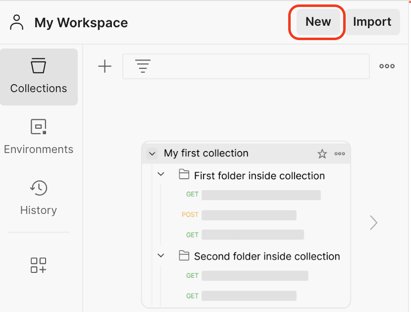
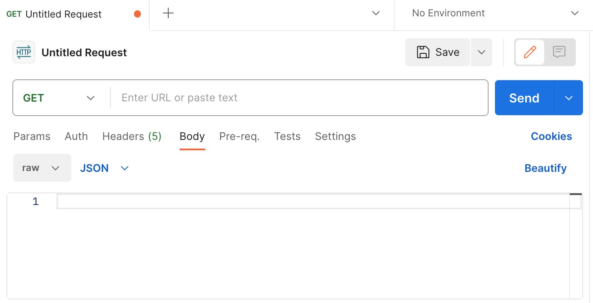

# Core RPCs Through Postman
---

## What is Postman
[Postman](https://www.postman.com/) is a popular software offering that makes it easy to create and use APIs. 

In this document, we'll cover the very basics of hitting an RPC endpoint with Postman. Is it not intended to be (or to replace) a full, end-to-end tutorial, but rather to offer an introduction to the subject. 

## Working with CORE RPCs Through Postman
1. First, you'll need to sign up with an account. Postman makes this very easy to do by manually entering your account details or with a gmail address. 


2. Projects in Postman are organized into "workspaces", so you'll need to make one to test this process. Click on the _New_ button in the left navigation pane.



3. You can choose from a number of different workspaces. For this example, we're going to use `HTTP`.


4. This will take you to a basic workstation, where you can structure your RPC query and get a response back. 



5. First, change the `GET` request to a `POST` request, as that's how our query will be structured. Then, add the RPC URL that you want to use to get data related to a specific Core Chain transaction. Remember that you can use any of the [valid Core RPC URLs](./rpc-list.md).


6. Then, head over to the Body tab and add the data from the following CURL request (note that in this example we are submitting the request as raw json).

```bash
curl -H "Content-Type: application/json" \
     -X POST \
     --data '{"jsonrpc":"2.0","method":"eth_getTransactionByHash","params":["0xc9c4a5d14857ace0db197c7393806868824763377f802645aacf6f38d9c309b7"],"id":1}' \
     --url 'https://rpc.ankr.com/core'
```


7. Once the `Send` button is hit, you'll get back a response in JSON with all the information we wanted about the transaction whose hash we passed in the request.


