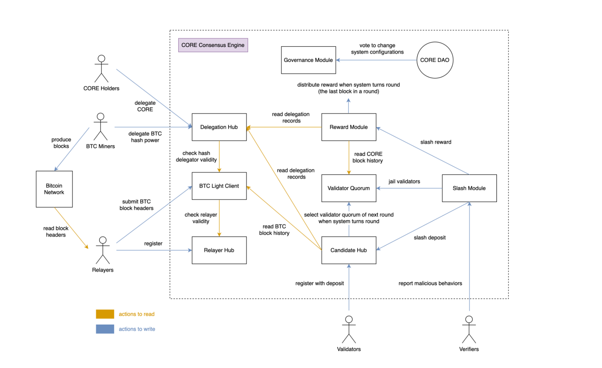

# Architecture of Core DAO
---

## Introduction

Core Chain, a Bitcoin-aligned EVM blockchain, represents a critical innovation for Bitcoin's integration into the decentralized finance (DeFi) space. This document outlines the architectural components of Core Chain, which is designed to function as a highly scalable smart contract platform that enhances Bitcoin’s utility without compromising its foundational principles.

## Satoshi Plus Consensus Mechanism

Core Chain introduces a novel consensus mechanism known as Satoshi Plus, a hybrid model that blends Delegated Proof of Work (DPoW) with Delegated Proof of Stake (DPoS). This model is designed to leverage the existing Bitcoin mining infrastructure to secure a smart contract platform, thereby providing a symbiotic relationship between the two chains.

### Delegated Proof of Work
- Bitcoin miners can participate in the DPoW by appending additional metadata in the `op_return` field of Bitcoin blocks. This metadata includes the address of the Core Validator to whom they wish to delegate their hashing power, and the address for receiving CORE token rewards.
- This mechanism allows miners to earn supplemental rewards in CORE tokens over and above their usual Bitcoin mining rewards, thus incentivizing their participation in the Core Chain ecosystem.

### Delegated Proof of Stake
- CORE token holders can stake their tokens with Core Validators, participating directly in the blockchain’s security and governance.
- Stakers receive CORE token rewards, aligning their interests with the overall health and security of the network.

## Core Chain Infrastructure

### Core-Native Bitcoin Wrapping (coreBTC)
- Core Chain facilitates the wrapping of Bitcoin through a decentralized mechanism. This involves locking Bitcoin on the Bitcoin blockchain and issuing an equivalent amount of coreBTC on Core Chain.
- Lockers and Porters play crucial roles in managing the lock and wrap processes, ensuring that coreBTC is backed 1:1 by Bitcoin, thus preserving trustlessness and security.

### Non-Custodial Bitcoin Staking
- This feature allows Bitcoin holders to stake their bitcoins in a non-custodial manner using absolute time locks. This means that users can earn yields on their bitcoins without relinquishing control over them.
- The staking mechanism integrates with the Satoshi Plus consensus, involving similar processes used by miners for securing the network.

## Atomic Swaps
- Core Chain supports trustless atomic swaps using Hashed TimeLock Contracts (HTLCs), facilitating the seamless exchange of tokens between Bitcoin and EVM-compatible chains.
- This feature enhances the interoperability and liquidity options available to both Bitcoin and Core Chain users, promoting a more integrated DeFi ecosystem.

## Future Enhancements

* **Governance Expansion:**
- Plans are underway to potentially include Bitcoin miners and stakers in the governance processes of Core Chain, further aligning incentives across both ecosystems.

* **Fee Market Development:**
- Core Chain may introduce local fee markets to make Bitcoin transactions faster and more economical, thus supporting Bitcoin's use as a viable means of payment.

* **HTLC Improvements:**
- Enhancements to the atomic swap process, including the introduction of liquidity pools and order book supplements, are considered to facilitate more efficient trading and liquidity management.

## Conclusion

Core Chain's architecture is designed to leverage Bitcoin’s robust security while expanding its functionality into smart contracts and DeFi. By integrating innovative consensus mechanisms and providing new utilities like non-custodial staking and decentralized wrapping, Core Chain positions itself as a pivotal platform in the evolution of Bitcoin DeFi.