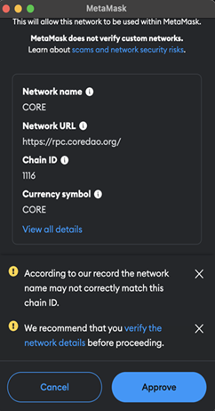
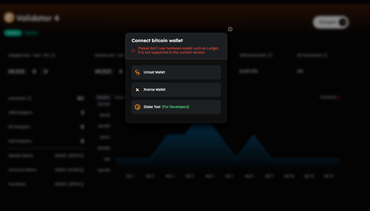
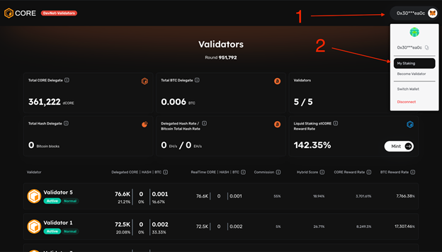

# Non-Custodial BTC Staking

This technical guide is designed to walk you through the process of staking your Bitcoin (BTC) on the Core blockchain to earn CORE token rewards. With Non-Custodial BTC Staking, you can earn passive yield in CORE while retaining ownership of your Bitcoin assets. Let's dive into how it works and how you can start staking today.

## Prerequisites

The following must be satisfied prior in order to complete this guide:

1. **Xverse and/or Unisat Wallet(s):** You will need to add to either [Xverse](https://chromewebstore.google.com/detail/xverse-wallet/idnnbdplmphpflfnlkomgpfbpcgelopg?hl=en-GB\&authuser=1) and/or [Unisat](https://chromewebstore.google.com/detail/unisat-wallet/ppbibelpcjmhbdihakflkdcoccbgbkpo) wallet(s) via Chrome browser extension, to participate in the staking process. (_Must use a desktop, mobile and hardware wallets are not supported at this time_)

2. **Core Wallet Address for Rewards:** Prepare your Core wallet address where you will receive Core token rewards for staking your BTC. If you do not have a Core wallet address, you can create one easily by connecting to MetaMask.

**1. Adding the Core network to MetaMask via the Core Explorer:**

* Go to [coredao.org](http://coredao.org) and scroll all the way down on the page

* Click the ‘Add Core Network’ button
* Approve in your MetaMask

2. Alternatively, you can use this guide: [Add Core to MetaMask](https://medium.com/@core\_dao/add-core-to-metamask-7b1dd90041ce) for a more detailed step by step guideline for manually filling out the network information.

## Before you Start Staking

Let's clarify the staking mechanism, so you know what to expect going into Non-Custodial BTC Staking.

1. **Minimum of 0.01 BTC + Gas Fee**

    * **Why is this necessary:** To ensure a smooth staking experience, you need to have a minimum of **0.01 BTC** available along with the necessary gas fee required for executing transactions on the Bitcoin network. Gas fees cover the cost of processing transactions on the blockchain. Additionally, we recommend having at least **0.05 BTC** if staking for less than **1 month**. This buffer accounts for potential network congestion, where transaction gas prices may exceed the earned staking reward.

2. **Understanding Staking Address Differences**

    * **What's happening:** You may notice that the staking address provided differs from your original Bitcoin address.
    * **What it means:** The staking address is derived from your wallet's master private key, ensuring your control and security over your assets. Your Bitcoin remains safely stored in the staking address controlled by your private key, unaffected by staking. We’re actively working with wallet partners to support this display of your assets in a timely manner.
    * You can view your staked funds by searching the staking address on a Bitcoin explorer, [Mempool.space](https://mempool.space/) is an option we recommend. We're actively working to make staked assets visible in the wallet.

3. **Considerations for Locking Periods**

    * **Important reminder:** Once you lock your Bitcoin for staking, it's inaccessible until the staking period concludes.
    * **Choosing wisely:**We advise selecting your locking period thoughtfully, taking into account your investment objectives and risk tolerance. Starting with shorter locking periods can help you become familiar with the process before committing to longer durations.

    These prompts aim to provide clarity and confidence as you embark on your Non-Custodial BTC Staking journey. Your understanding and preparedness are key to a successful staking experience. Now, let's guide you through the step-by-step process of staking your Bitcoin on the Core blockchain and earning Core token rewards.

## How Non-custodial BTC Staking Works

### Overview of the Staking Process

Non-Custodial BTC staking introduces a secure and decentralized method for Bitcoin holders to earn rewards. By locking your Bitcoin within the original network through a time-bound mechanism, you can actively participate in the Core blockchain's Consensus mechanism while staking. Here are the steps involved in this process.

1. **Initiate Staking:** Start by accessing the staking platform using either the [command line interface for technical users](https://github.com/coredao-org/btc-staking-tool)  or the web-based frontend for general users [https://stake.coredao.org](https://stake.coredao.org)
2. **Stake BTC with Time-Lock:** Stake your Bitcoin by sending a transaction on the Bitcoin network with a time-lock parameter, ensuring that your BTC remains locked until the specified period ends. The minimum staking period is **10 days**.
3. **Vote for Validators:** Delegate your staked BTC to the chosen validator on the Core blockchain.
4. **Connect Core Chain’s wallet for rewards:** Verify your Core address in the return field, where you'll receive Core token rewards.
5. **Claiming Rewards:** Core token rewards will appear when users connect their wallet, and can be claimed daily. Core token rewards will appear on the (staking site)\[[https://stake.coredao.org](http://stake.coredao.org/)].
6. **Redeem BTC:** Once the staking lock time expires, the staked BTC will remain idle in the staking address until redeemed by the user.

## Non-Custodial BTC Staking Walkthrough 

To begin staking your Bitcoin on the Core blockchain and earn Core token rewards, follow these steps:

### Connect Your Wallet

Connecting your wallet is the first step towards accessing the staking platform and initiating the staking process. This will enable you to interact with the Core blockchain and participate in Non-Custodial BTC Staking.

1. Visit [https://stake.coredao.org](https://stake.coredao.org)

2. Once on the website, locate and click on the "**Connect Wallet**" button.

3. **Choose an available wallet**

    * If you do not yet have a wallet, refer to **[Core Wallet for Rewards](#prerequisites)** in the prerequisite section above.

4. **Choose a validator to delegate BTC**

Here, we will be selecting a validator that we’d like to delegate our BTC to. In the example shown, we will be choosing Validator 4, but you’re free to choose any active validator.

    1. Click name of chosen validator to select

    2. Hover over Delegate, and then select ‘BTC’ on the dropdown

### Connect BTC wallet

    1. Upon selecting a validator to delegate BTC in the previous step, you will be prompted to connect a BTC wallet

:::info
In this example, we demonstrate using Unisat Wallet, but it's compatible with Xverse Wallet as well. Ensure you have either of these two installed.
:::

    2. On the Connect wallet pop up screen, select one of the available wallets.

* For developers and more advanced users who are interested in using the Stake Tool, refer[ here.](https://github.com/coredao-org/btc-staking-tool?tab=readme-ov-file)

    3. On the following screen, click **Connect**

### Delegate BTC

While initiating the delegation process, it's important to understand and specify several key parameters:

1. **Specifying the amount of BTC you’d like to delegate**

* The minimum amount to delegate is **0.01 BTC**
* In our example, we will be delegating **0.05 BTC** which satisfies this requirement

2. **Setting the lock time** – this determines when your staked BTC will be unlocked and available for use again on your local device.

* Select inside lock time box to input values
* The default lock time is set to a month in advance. The minimum lock time is **10 days.**
* In our example, we’ve selected a date 10 days in advance (April 24)
* Click ‘**OK**’ to proceed

3. Specifying the network priority speed for your transaction

4. Finally, click ‘**Confirm Delegation**’ to **Delegate BTC**

5.  Before Signing the transaction in your wallet, verify the transaction outputs to make sure it includes an OP\_Return output.  OP\_Return output is where your redeem\_script is saved and is essentially for redeeming your staked BTC. There may be 2 or 3 outputs, but at least one of the outputs should always be OP\_Return. Abort the transaction if it doesn't include the OP\_Return output.

6. Verify Transaction Submitted

5. From any CORE screen, hover over your connected wallet in the top right corner click ‘**My Staking**’.

6. At the **Delegator** screen, look for the column **BTC(x)** and click.

    

7. Verify your chosen validator is pending transaction confirmation.

    

8. Verify your chosen validator says ‘**Rewarding**’ under '**Redeem** **Time**'.

    

**Congratulations.** You have succesfully staked your BTC on the Core blockchain and will now actively earn CORE tokens from your delegated BTC. Through staking BTC and voting for validators, you actively contribute to the governance and security of the Core network, helping maintain its balance and decentralization.

We’re happy you’ve chosen to journey into BTCfi with Non-Custodial BTC Staking on Core!
