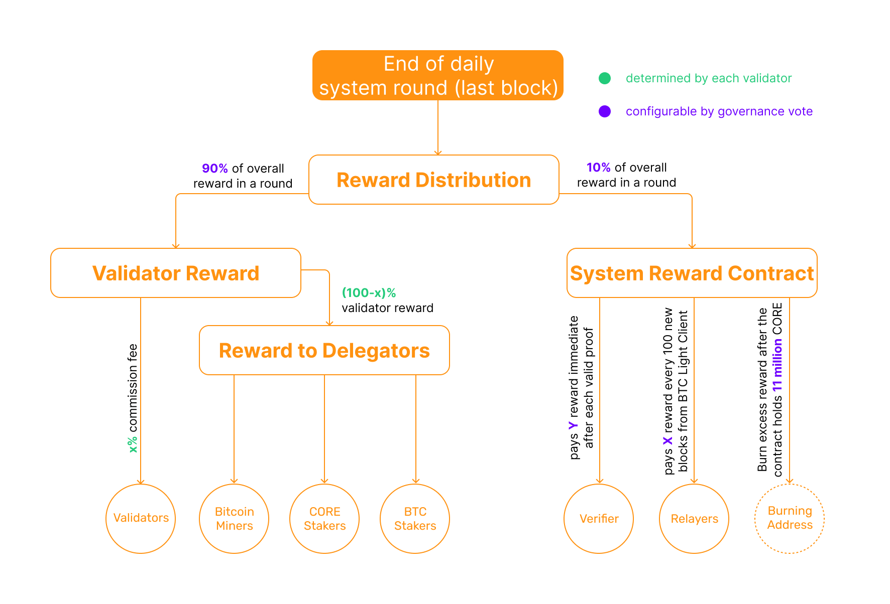

# Overview of Validators
---

In the Core DAO ecosystem, validators are crucial participants who maintain the integrity, security, and continuity of the blockchain. They are responsible for processing transactions, creating new blocks, and participating in the consensus process. This role is pivotal in ensuring that the Core DAO operates efficiently and remains decentralized.

## Who are Validators in the Core Network

In the Core DAO ecosystem, validators play a crucial role in maintaining the integrity and security of the blockchain by producing and validating new blocks. These validators engage in the Satoshi Plus consensus mechanism, which blends elements of Delegated Proof of Work (PoW) and Delegated Proof of Stake (DPoS). The validators are selected based on a hybrid scoring system that accounts for both the BTC and CORE tokens staked in their favor and the Bitcoin hash power delegated to them. This unique method ensures that the validator set represents a balanced mix of stakeholder interests and mining power, enhancing the network's security and decentralization. Validator elections occur in cycles known as epochs, with each new set of validators being chosen to manage the blockchain's operations and governance effectively.

## Economics
Validator's rewards come from 
    1. **Base rewards**, i.e. newly minted CORE tokens;
    2. **Fees collected from transactions in each block**;

Base rewards are calculated and distributed when the last block of a round is mined. Currently, **90%** of the rewards go to the validators and **10%** of the rewards go to the `System Reward Contract`. Of the **90%** paid to validators, some percentage is taken as a commission by the validator before they pay out their delegates. Each validator has an equal probability of producing blocks, so in the long run, all stable validators should get a similar portion of the reward.

Validators share rewards with the entities that delegated to them – including CORE stakers, bitcoin stakers, and PoW delegators – but they decide how much to give back by deciding how much they (the validators) choose to keep for themselves. Validators can take as much or as little of the reward as they want, though they’re incentivized to be generous in order to attract more stake and hash power.

Validators are required to share rewards with the delegators who staked CORE or delegated hash power to them. Given the fact that each validator has an equal probability of producing blocks, all stable validators should get a similar portion of the rewards, in the long run. The portion validators keep for themselves (commission fees) will be distributed directly to their fee addresses at the end of each round. 



Let us assume that the reward for a block is **100 CORE** and that a certain validator sets its commission rate to **20%**. These tokens do not go directly to the proposer. Instead, they are shared among validators and delegators. These **100 CORE** will be distributed according to each participant's stake. Assume that the fees generated from all transactions in the block was **1 CORE**.

```maths
    System Reward Contract gets = 100 x 10% = 10 CORE  

    Accumulated Validator Reward = 100 x 90% = 90 CORE

    Commission = 90 x 20% = 18 CORE

    Validator gets = Fees from txs in the block + Commission = 1 CORE + 10 CORE = 11 CORE

    All delegators gets = 90 x 80% - Commission = 54 CORE
```

:::note
In the Core ecosystem, the rewards are distributed to each validator, from that reward valdiators are required to keep a percentage in the form of commission and distribute the rest to its delegators. Each validator can set its own commission rate. However, there is no self-bonded CORE. Validator only gets commissions if they don't want to stake on their own validator.
:::

## Potential Risks and Penalties for Validators
In the Core DAO ecosystem, validators play a crucial role in maintaining the network's integrity and security. While this role comes with incentives like earning rewards for block validation, it also involves certain risks and potential penalties if validators fail to perform their duties adequately or engage in malicious activities. Here’s a detailed overview of the potential risks and penalties for validators in the Core DAO ecosystem:

1. **Slashing Risks:** Validators in many DPoS systems, including Core DAO, face the risk of slashing if they act maliciously or negligently. This could involve double signing, downtime (failing to be online and perform validation duties), or any actions that compromise the network's security. Slashing involves a portion of the staked CORE tokens being destroyed or taken away, which directly impacts the validator’s financial holdings.

2. **Stake Lock-up and Liquidity Risk:** Validators must lock up a significant amount of CORE tokens as collateral to participate in the validation process. This stake is subject to lock-up periods during which the funds cannot be accessed, posing a liquidity risk, especially if the market conditions change dramatically.

3. **Jailing of Validators:** Validators who consistently underperform or violate network protocols may be "jailed." This term refers to temporarily removing them from the validator set, preventing them from participating in consensus and earning rewards. This not only affects their revenue but can also tarnish their reputation within the community.

4. **Loss of Delegation:** Validators depend on delegations from CORE token holders to increase their influence and earning potential. Poor performance or high penalty rates can lead delegators to withdraw their support and reallocate their stakes to more reliable validators, leading to a significant decrease in potential earnings.

5. **Operational and Security Risks:** Running a validator node requires technical competence. Validators must ensure their systems are secure and running efficiently 24/7. Failure to manage these operational risks can lead to missed blocks or security breaches, potentially leading to financial losses or reputational damage.
